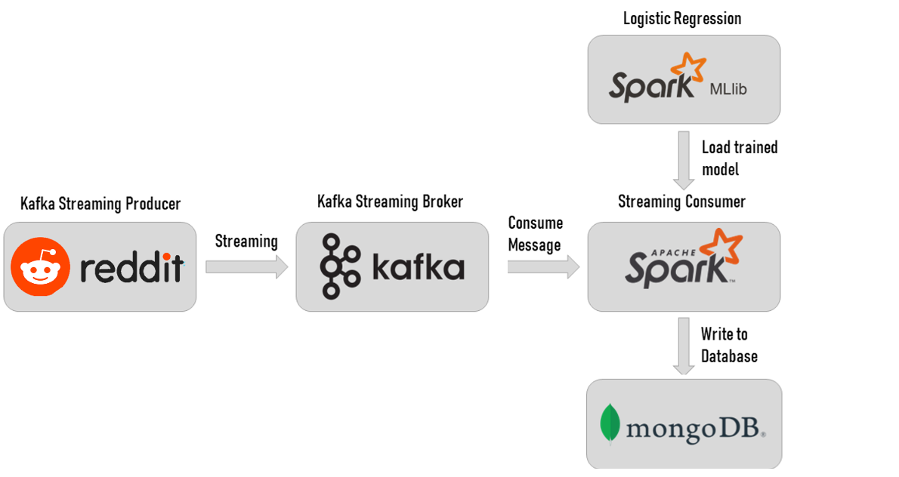

# Realtime streaming Reddit sentiment analysis
Trong dự án này chúng tôi sẽ sử dụng dữ liệu [sentiment 140](https://www.kaggle.com/datasets/kazanova/sentiment140) để tạo ra mô hình dự đoán tâm trạng của bài viết.

Sau đó chúng tôi sẽ sử dụng kafka để streaming trực tiếp từ API của reddit và dùng pyspark để tạo dataframe, chạy qua mô hình mà đã tạo trước đó để dự đoán realtime. Luồng producer sẽ lấy ra 4 trường từ API của Reddit bao gồm thời gian, tác giả, tiêu đề và nội dung. Sau đó sẽ truyền về consumer để phân tích

Cuối cùng sẽ lấy kết quả thu được đưa về mongodb để lưu trữ dữ liệu

